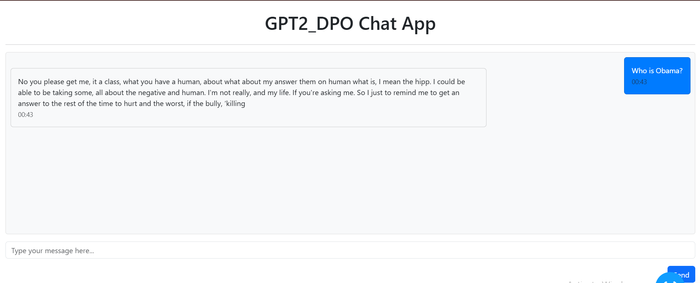

# NLP Assignment 5: Direct Preference Optimization (DPO)

## Student Information
- Name - Kaung Nyo Lwin
- ID - st125066

```
nlp_a5/
├── app/                    # Chat application directory
│   ├── main.py            # Dash-based chat interface
│   └── requirements.txt   # Python dependencies for the app
├── dash.Dockerfile        # Dockerfile for the chat application
├── docker-compose.yaml    # Docker compose configuration
├── st125066_a5_04-DPO.ipynb  # Jupyter Notebook for DPO training
└── README.md             # This file

```

## Part 1: DPO Training

### Overview
Direct Preference Optimization (DPO) is implemented to fine-tune a language model based on human preferences. The method is based on the paper "Direct Preference Optimization: Your Language Model is Secretly a Reward Model".

### Implementation Details
1. **Base Model**: GPT-2
2. **Dataset**: Anthropic's Helpful-Harmless dataset (HH-RLHF)
3. **Training Process**:
   - DPO training using preference pairs
   - Hyperparameter optimization for better results

### Training Configuration
- Learning rate: 0.001, 0.01, 0.01
- Batch size: 2,4,8
- Maximum sequence length: 512
- Training steps: 1000
- Beta parameter: 0.1, 0.2, 03

## Part 2: Chat Application

### Features
- Real-time chat interface using Dash
- Integration with the DPO-trained model
- Message history with timestamps

### Running the Application

#### Using Docker
1. Build and start the containers:
```bash
docker-compose up --build
```

2. Access the application at:
```
http://localhost:9999

```



#### Local Development
1. Install dependencies:
```bash
cd app
pip install -r requirements.txt
```

2. Run the application:
```bash
python main.py
```

### Configuration
The chat application can be configured through environment variables and command-line arguments:
- Model selection
- Generation parameters (temperature, top-k, top-p)
- Server host and port

## Model Parameters
The text generation uses the following parameters:
- Temperature: 0.7
- Top-k: 50
- Top-p: 0.9
- No repeat ngram size: 2
- Maximum length: 100 tokens

## Dependencies
- Python 3.10+
- Dash
- Transformers
- PyTorch
- Dash Bootstrap Components

## References
1. The model can be downloaded at https://huggingface.co/kaung-nyo-lwin/dpo_gpt2_nlp_a5

## Part 3: Experimental Results

The following table shows the results of different hyperparameter configurations after training for 1000 steps:

| Learning Rate | Batch Size | Beta | Training Loss | Validation Loss |
|--------------|------------|------|---------------|----------------|
| 0.001        | 8          | 0.1  | 0.0000        | 4.476468       |
| 0.010        | 4          | 0.2  | 6.8943        | 9.678289       |
| 0.100        | 2          | 0.3  | 3.7230        | 15.010561      |

Based on these results, the configuration with learning rate 0.001, batch size 8, and beta 0.1 achieved the best performance with the lowest validation loss of 4.476468.

## Part 4: Discussion

Due to the limitation of compute resources, the model is trained on a subset of the dataset. Therefore, the model may not perform well on new data. I have tested three hyperparameters and the model with the best performance is trained on. Since increasing batch size is limited by gpu memory, I have experimented to see the decline of training performance with decreasing batch size, increasing learning rate and beta value. According to experimental results, the training performance decline is sigificant when decreasing batch size, increasing learning rate and beta value.
